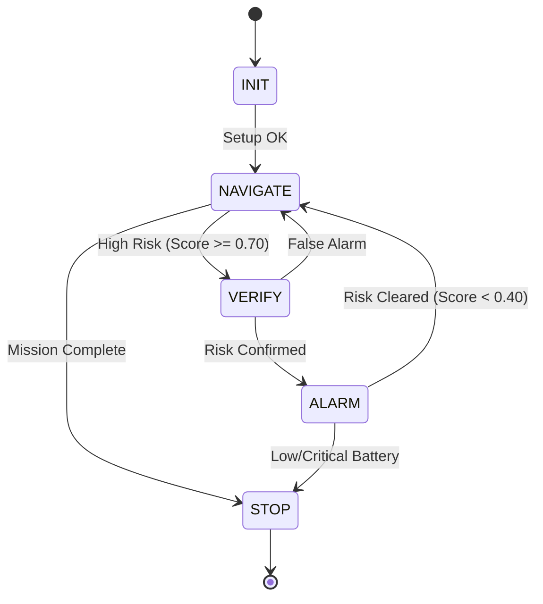

# M6 Decision Engine

The M6 Decision Engine operates as the central Finite State Machine (FSM) of the SeeFire fire-detection robot. It coordinates sensor fusion, path traversal commands, threat verification, alarm execution, and SQLite/snapshot persistence.

## Runtime FSM States

- **INIT**: Initializes BCM GPIO pins, data loggers, L298N motor drivers, sensors, and camera thread.
- **NAVIGATE**: Commands the M5 Navigation controller to run waypoint sectors. Periodically checks battery health (raises emergency stop if `voltage < 6.4V`).
- **VERIFY**: Triggered by `ThreatVerificationTriggered` when a sector midpoint scanning or waypoint snapshot calculates a high fusion score. The robot stops and samples the environment for 2 seconds.
- **ALARM**: Activates hardware LED and buzzer alarms. Remains active until the risk score drops below `0.40`.
- **STOP**: Disables PWM channels, stops all motors, closes the camera connection, and cleans up GPIO pins safely.

## Sensor Fusion Math

Risk scores are calculated using a weighted average:
$$Score = (W_{vision} \times Conf_{vision}) + (W_{smoke} \times Conf_{smoke}) + (W_{ir} \times Conf_{ir})$$

- **Vision Confidence**: YOLOv8n confidence score. In non-YOLO mode, defaults to `0.6` on waypoint snapshots and `0.1` elsewhere to represent active area coverage.
- **Smoke Score**: MQ-2 voltage mapped linearly to $0.0-1.0$ (ADC max 4095).
- **IR Score**: MLX90614 object temperature mapped to $0.0-1.0$ relative to `config.IR_TEMP_THRESHOLD` (60.0°C).

## Directory Structure

- `decision.py`: Main FSM loops, battery health handlers, and database integrations.
- `tests/test_decision.py`: Unit tests verifying FSM state progressions, score algebra, and thread verification exceptions.
